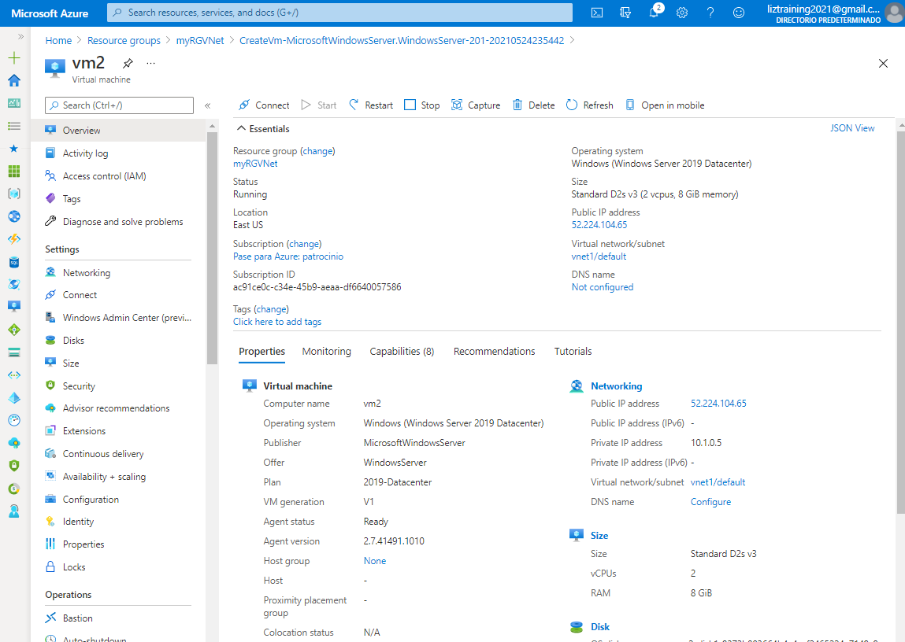
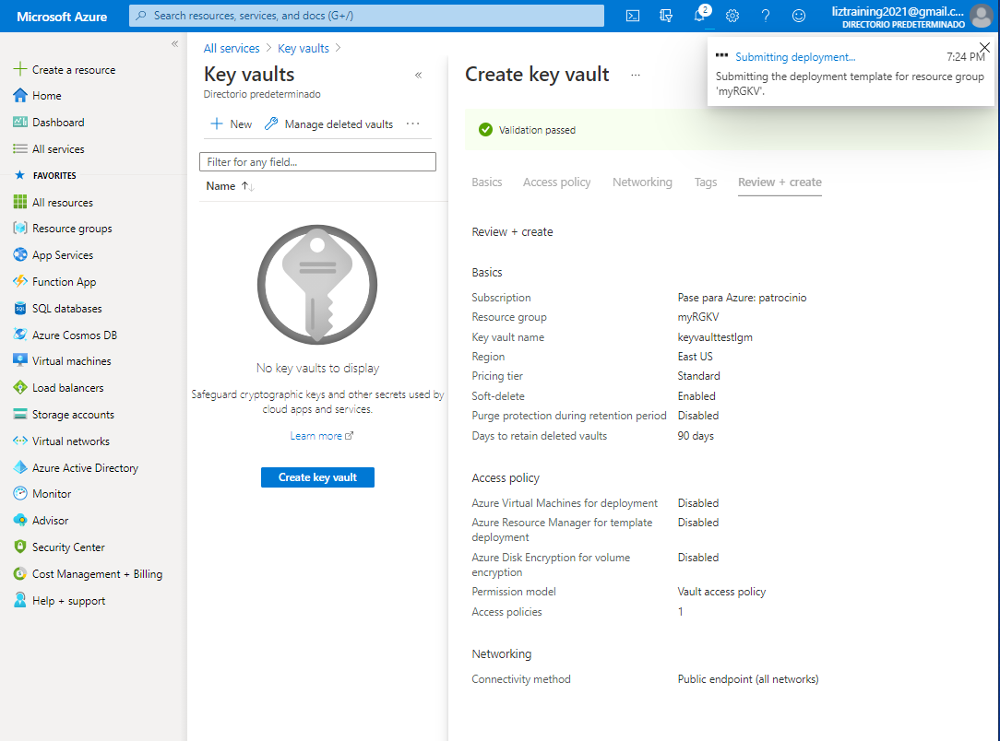

# Practica 01 - Create Virtual Machine in the portal

# Practica 02 - Create a Web App

# Practica 03 - Deploy Azure Container Instances

Resultado de la instalación del Container Instance

Resultado de ejecutar el contenedor de instancia

Fin de la práctica borrando el recurso

# Practica 04 - Create a virtual network

# Practica-05 - Create blob storage

# Practica-06 - Create a SQL database

# Practica-07 - Implement an Azure IoT Hub

# Practica-08 - Implement Azure Functions

# Practica-09 - Create a VM with a Template

# Practica-10 - Create a VM with PowerShell

# Practica-11 - Create a VM with the CLI

# Practica-12 - Implement Azure Key Vault

# Práctica-13 - SecureNetworkTraffic

# Practica 14 - Manage access with RBAC

# Práctica 15 - Manage resource locks

# Práctica 16 - Implement resource tagging

# Práctica 17- Create an Azure Policy

# Práctica 18 - Explore the Trust Center

# Práctica 19 - Use the Pricing Calculator

# Práctica 20 - Use the Azure TCO Calculator

# Práctica 21 - Calculate Composite SLAs

# Práctica 22 - Open a Support Request

# 

