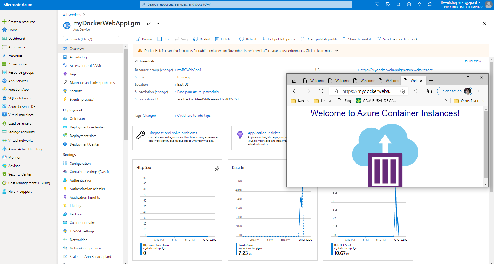
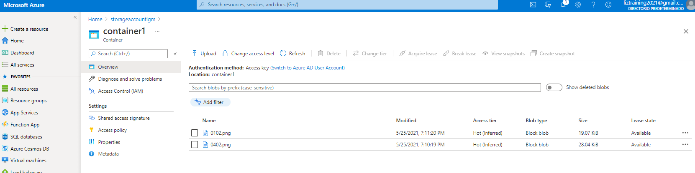

# Practica 01 - Create Virtual Machine in the portal

# Practica 02 - Create a Web App

# Practica 03 - Deploy Azure Container Instances

Resultado de la instalación del Container Instance

Resultado de ejecutar el contenedor de instancia

Fin de la práctica borrando el recurso

# Practica 04 - Create a virtual network

# Practica-05 - Create blob storage

# Practica-06 - Create a SQL database

# Practica-07 - Implement an Azure IoT Hub

# Practica-08 - Implement Azure Functions

# Practica-09 - Create a VM with a Template

# Practica-10 - Create a VM with PowerShell

# Practica-11 - Create a VM with the CLI

